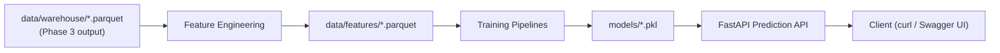

# HotelMind ML — Phase 4 (Machine Learning)

Phase 4 of the **HotelMind AI** portfolio project. Builds five ML modules —
occupancy forecasting, dynamic pricing, restaurant demand, staff
optimization, and customer churn — served by a FastAPI prediction API,
reading **only** from local parquet files produced by Phase 3. No live
Postgres connection is required to train, predict, or run the API.

## Project Overview

- **Occupancy** forecasting (Prophet + XGBoost) — 30-day forecast with confidence interval
- **Dynamic Pricing** (XGBoost) — recommended price + expected revenue per room type
- **Restaurant Demand** (3× XGBoost, per meal) — revenue + quantity, breakfast/lunch/dinner
- **Staff Optimization** (GradientBoostingRegressor) — required headcount per department
- **Customer Churn** (Random Forest + XGBoost) — probability + risk level

Every model was **actually trained** in this environment against real (or,
for Restaurant/Staffing, clearly-documented synthetic) data — see
[reports/final_phase4/training_results.md](reports/final_phase4/training_results.md)
for real, non-placeholder metrics.

Out of scope for this phase: LLMs, LangChain, RAG, MLflow, Kafka, AWS,
Terraform, Docker changes, monitoring. Those belong to later phases (see
Roadmap below).

## Architecture



Full diagrams: [docs/architecture/](docs/architecture/) (system overview,
Phase 4 pipeline, training pipeline, prediction flow — all Mermaid).

## Installation

```bash
git clone <this-repo>
cd hotelmind-ml
python -m venv .venv
.venv\Scripts\activate        # Windows
# source .venv/bin/activate   # macOS/Linux
pip install -r requirements.txt
```

No `.env`/`WAREHOUSE_DB_*` configuration is required for training,
prediction, or the API — every module reads local parquet under
`data/processed/` and `data/warehouse/`. `.env` is only relevant if you also
run the Phase 3 warehouse loader's optional
`python -m src.pipelines.warehouse_loader --write-db` path.

## Training

```bash
# Recommended: retrain everything at once, using the dataset's real date range
python scripts/train_all.py

# Or run each module individually:
python -m src.pipelines.feature_engineering
python -m src.training.train_occupancy --branch-id 1 --start-date 2015-07-01 --end-date 2017-09-13
python -m src.training.train_pricing --branch-id 1 --start-date 2015-07-01 --end-date 2017-09-13
python -m src.training.train_restaurant --branch-id 1 --start-date 2015-07-01 --end-date 2017-09-13
python -m src.training.train_staffing --branch-id 1 --start-date 2015-07-01 --end-date 2017-09-13
python -m src.training.train_churn
python -m src.pipelines.generate_occupancy_report
```

`--start-date`/`--end-date` default to `2023-01-01`..today in each training
CLI, which does **not** overlap the canonical dataset's real date range
(2015-07-01 to 2017-09-13) — pass explicit dates, or training runs over zero
rows.

## Prediction

```bash
# Programmatically, no server needed:
python scripts/predict_examples.py

# Or via the running API:
uvicorn api.main:app --reload
curl -X POST http://127.0.0.1:8000/predict/occupancy \
  -H "Content-Type: application/json" -d @demo/sample_requests/occupancy.json
```

## API

Interactive docs (Swagger UI) at `http://127.0.0.1:8000/docs` once the
server is running. Per-endpoint reference (purpose, request/response
schema, validation, errors, curl example): [docs/api/](docs/api/).

| Endpoint | Module |
|---|---|
| `POST /predict/occupancy` | Occupancy forecasting |
| `POST /predict/pricing` | Dynamic pricing |
| `POST /predict/restaurant` | Restaurant demand |
| `POST /predict/staff` | Staff optimization |
| `POST /predict/churn` | Customer churn |
| `GET /health` | Health check |

Real example requests/responses (captured from the live API against trained
models, no placeholders): [demo/](demo/).

## Tests

```bash
pytest tests/ -v
```

75/75 tests passing, fully offline — no live database dependency. Verify
the full Phase 4 deliverable set (feature datasets, models, reports, API,
predictions, folder structure):

```bash
python scripts/verify_phase4.py
```

## Folder structure

```
hotelmind-ml/
├── api/                    FastAPI prediction service (main.py, schemas.py, routers/)
├── data/
│   ├── raw/                 seed CSVs incl. synthetic Restaurant/Staffing data
│   ├── processed/            Phase 3 cleaned dataset
│   ├── warehouse/            Phase 3 star-schema warehouse
│   └── features/              Phase 4 feature datasets
├── demo/                    real sample requests/responses per endpoint
├── docs/
│   ├── api/                  per-endpoint API reference
│   ├── architecture/          Mermaid architecture diagrams
│   ├── models/                 model cards (one per domain)
│   ├── datasets/                dataset/warehouse/synthetic-data documentation
│   └── demo/                    portfolio screenshot checklist
├── doc/                     original Phase 4 architecture/running/assumptions docs
├── models/                  trained joblib artifacts (*.pkl)
├── reports/
│   ├── data_discovery/        Phase 3: raw dataset profiling
│   ├── warehouse_loading/      Phase 3: warehouse build reports
│   ├── features/                 Phase 4: feature dictionary/statistics/correlation
│   ├── models/                    Phase 4: metrics, forecast, comparison, leaderboard
│   ├── model_discovery/            Phase 4: feature/model landscape docs
│   ├── final_phase4/                Phase 4: summary, results, API examples, limitations
│   └── final_release/                this milestone: release readiness report
├── scripts/                 train_all.py, predict_examples.py, verify_phase4.py
├── src/
│   ├── config/                Settings, constants
│   ├── database/                get_connection(), run_query() (legacy Postgres path)
│   ├── features/                 calendar/time-series/preprocessing + domain features
│   ├── models/                    BaseMLModel + per-domain model subclasses
│   ├── pipelines/                  BasePipeline + per-domain pipelines
│   ├── training/                    CLI entrypoints: train_*.py
│   ├── prediction/                   predict_*.py — used by both CLI and API
│   ├── evaluation/                    metrics.py, report_writer.py
│   └── utils/                          logging
├── tests/                   75 pytest tests
├── CHANGELOG.md
├── LICENSE
└── requirements.txt
```

## Roadmap

```text
✅ Phase 1 – Infrastructure
✅ Phase 2 – Hotel Management System
✅ Phase 3 – Data Engineering
✅ Phase 4 – Machine Learning
⬜ Phase 5 – AI Assistant
⬜ Phase 6 – MLOps
⬜ Phase 7 – Cloud Deployment
```

Phase 4 status: **complete**, in release-preparation polish (this
milestone). See
[reports/final_release/phase4_release_report.md](reports/final_release/phase4_release_report.md)
for the full readiness assessment.

## Demo

Real, live-captured API request/response pairs for all 5 endpoints:
[demo/](demo/). Portfolio screenshot checklist (folder structure, reports,
Swagger UI, test results): [docs/demo/screenshots_required.md](docs/demo/screenshots_required.md).

## Known Limitations

- **Restaurant and Staffing models are trained on synthetic data** — no real
  data for either domain exists anywhere in this project. Never present
  their output as a real business forecast.
- **Occupancy percentage is relative to an assumed room-capacity constant**
  (no room-inventory data exists in the source dataset).
- **The canonical dataset only covers 2015-07-01 to 2017-09-13** — forecast/
  snapshot anchoring accounts for this (see below), but training CLI
  date-range defaults do not.
- **Churn model metrics are near-perfect by construction** (the label is a
  deterministic function of one of the model's own input features) — not
  evidence of unusually strong real-world predictive power.

Full detail, including 12 documented assumptions:
[reports/final_phase4/known_limitations.md](reports/final_phase4/known_limitations.md).

## Future Work

- Phase 5 (AI Assistant), Phase 6 (MLOps), Phase 7 (Cloud Deployment) — see Roadmap.
- Replace synthetic Restaurant/Staffing data with real data if a source ever exists.
- Implement the intentionally-scaffolded LSTM occupancy model (`src/models/occupancy/lstm_model.py`) and OR-Tools shift scheduler (`src/models/staffing/or_tools_scheduler.py`).
- Add in-memory model caching to the API (currently loads from disk on every request).
- Resolve the pricing room-type-source inconsistency noted in [docs/models/pricing.md](docs/models/pricing.md).

## Contributors

- Bhanu Hasaranga — project author

Contributions welcome — open an issue or PR.

## License

[MIT](LICENSE) — see `LICENSE` file.

## Documentation Index

- [doc/architecture.md](doc/architecture.md), [doc/running.md](doc/running.md), [doc/assumptions.md](doc/assumptions.md) — original Phase 4 build documentation
- [docs/api/](docs/api/), [docs/architecture/](docs/architecture/), [docs/models/](docs/models/), [docs/datasets/](docs/datasets/), [docs/demo/](docs/demo/) — release documentation (this milestone)
- [reports/model_discovery/](reports/model_discovery/), [reports/final_phase4/](reports/final_phase4/), [reports/final_release/](reports/final_release/) — generated reports
- [CHANGELOG.md](CHANGELOG.md) — version history
