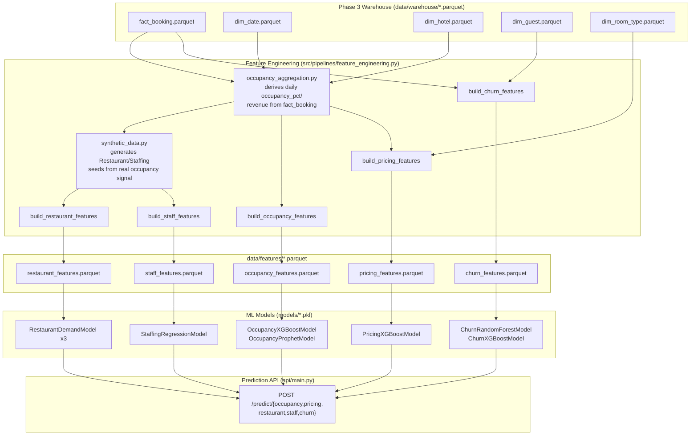

# Phase 4 Pipeline

The requested "Hotel System → Warehouse → Feature Engineering → ML Models →
Prediction API" flow, as actually implemented in this repository.

## Notes

- **No `mart_occupancy_daily`/`mart_revenue_daily`/`mart_restaurant_daily`/
  `mart_staff_daily` tables exist anywhere** — the boxes labeled
  `occupancy_aggregation.py` and `synthetic_data.py` substitute for them,
  computed entirely in-process from parquet. See
  `reports/model_discovery/pipeline_diagram.md` for the original discovery
  of this gap.
- `feature_engineering.py` is a **standalone orchestration layer** — it
  calls the same `src/features/*.py` functions each domain pipeline uses
  internally, and additionally persists the result to
  `data/features/*.parquet` for inspection. Pipelines never call into
  `feature_engineering.py`, and vice versa — both call into `src/features/`.
- Full column-level detail: `reports/model_discovery/feature_mapping.md`.
