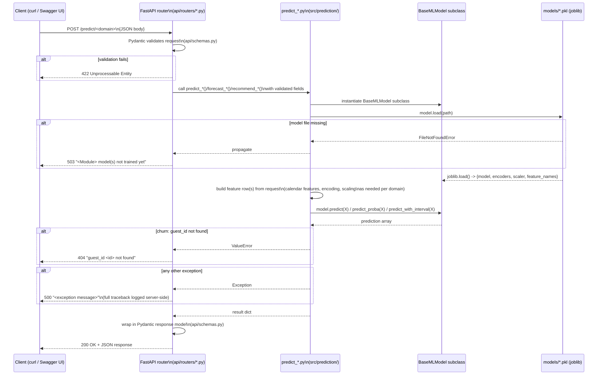

# Prediction Flow

How a single API request is served, from HTTP request to trained-model
output.

## Per-domain differences

| Domain | Prediction function | Extra I/O at request time |
|---|---|---|
| Occupancy | `predict_occupancy.py::forecast_occupancy` | reads `model.history["ds"].max()` from the loaded Prophet model to anchor the forecast start date — no parquet read |
| Pricing | `predict_pricing.py::recommend_price` | reads `data/raw/room_type_dim.csv` to resolve `room_type_id` |
| Restaurant | `predict_restaurant.py::forecast_restaurant_demand` | none — all 3 meal models loaded and predicted in sequence |
| Staffing | `predict_staffing.py::recommend_staffing` | none |
| Churn | `predict_churn.py::predict_churn` | reads `data/warehouse/dim_guest.parquet` + `fact_booking.parquet` to look up the guest and compute `total_nights`/`recency_days` |

No domain queries a live database at prediction time — the only I/O beyond
the model `.pkl` file itself is reading local parquet/CSV seed files.

## Startup behavior

`api/main.py`'s `lifespan` context calls `api/model_cache.py::warm_cache()`
on server start, which currently only **logs** whether `models/` exists —
it does not eagerly load any model into memory. The first request to each
endpoint pays the full `joblib.load()` cost; subsequent requests to the same
endpoint still reload from disk each time (no in-memory caching is
implemented — see `reports/final_phase4/known_limitations.md` for related
caveats, and treat this as a known future-work item, not a bug to fix in
this milestone).
