# System Overview

The HotelMind AI portfolio spans multiple phases and (per the roadmap)
multiple repositories/subsystems. This diagram shows where this repository
(`hotelmind-ml`, Phase 4) sits in the overall data flow — Phases 1–2 (hotel
system) and the `hotelmind-data` warehouse project are shown for context but
are **not part of this repository**.

## End-to-end system flow

```mermaid
flowchart LR
    subgraph P2["Phase 2 — Hotel Management System\n(separate project)"]
        HS[Hotel bookings, guests,\nreservations — operational DB]
    end

    subgraph P3["Phase 3 — Data Engineering\n(this repo: src/pipelines/data_cleaning.py,\nwarehouse_loader.py)"]
        CSV["Canonical booking dataset\nhotel_bookings.csv"]
        Clean["data_cleaning.py"]
        CleanedP["data/processed/\nhotel_bookings_clean.parquet"]
        Load["warehouse_loader.py"]
        WH["data/warehouse/\ndim_date, dim_hotel, dim_guest,\ndim_room_type, fact_booking (.parquet)"]

        CSV --> Clean --> CleanedP --> Load --> WH
    end

    subgraph P4["Phase 4 — Machine Learning\n(this repo)"]
        FE["Feature Engineering\nsrc/pipelines/feature_engineering.py"]
        Feat["data/features/*.parquet"]
        Train["Training pipelines\nsrc/pipelines/*_pipeline.py"]
        Models["models/*.pkl"]
        API["Prediction API\napi/main.py (FastAPI)"]

        WH --> FE --> Feat --> Train --> Models --> API
    end

    subgraph Client["API Clients"]
        UI[Swagger UI / curl / future dashboard]
    end

    HS -.->|"future: live sync\n(not implemented)"| CSV
    API --> UI
```

## What this repository actually contains

`hotelmind-ml` implements everything inside the **Phase 3** and **Phase 4**
boxes above. The Phase 2 hotel management system box is shown for narrative
completeness (it's the conceptual origin of booking data in the portfolio
story) — this repository's canonical dataset is a static Kaggle CSV
(`hotel_booking_demand/original/hotel_bookings.csv`), not a live feed from a
running hotel system. See `docs/datasets/canonical_dataset.md` for why.

## Key architectural decision: no live database dependency

Every Phase 4 component reads only from local parquet files
(`data/processed/`, `data/warehouse/`) written by Phase 3. No live
PostgreSQL connection is required to train models, generate predictions, or
run the API — see `docs/architecture/phase4_pipeline.md` for the detailed
data flow and `reports/final_phase4/known_limitations.md` for why this
design was chosen (the originally scaffolded Postgres-warehouse-mart
approach assumed tables that were never populated).

## Related diagrams

- `docs/architecture/phase4_pipeline.md` — warehouse → features → models, in detail
- `docs/architecture/training_pipeline.md` — train → save → evaluate flow
- `docs/architecture/prediction_flow.md` — saved models → API → client
