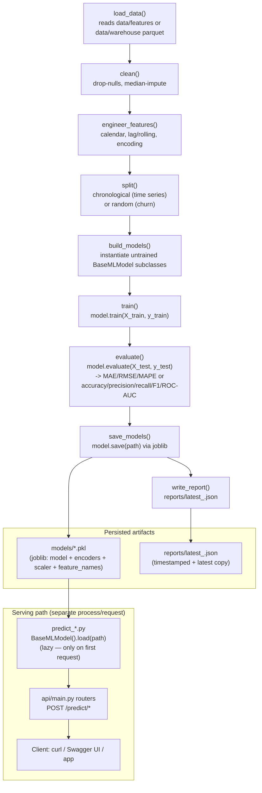

# Training Pipeline

The requested "Training Pipeline → Saved Models → FastAPI → Client" flow,
as actually implemented by `src/pipelines/base_pipeline.py::BasePipeline`.

## Key design points

- **`BasePipeline.run()`** (`src/pipelines/base_pipeline.py`) implements the
  Load→Clean→Engineer→Split→Train→Evaluate→Save→Report sequence exactly
  once; every domain pipeline only overrides the pieces that differ
  (`load_data`, `clean`, `engineer_features`, `split`, `build_models`).
- **`BaseMLModel`** (`src/models/base.py`) gives every algorithm — XGBoost,
  Random Forest, GradientBoostingRegressor, Prophet — the same
  `train`/`evaluate`/`predict`/`save`/`load` interface, so the pipeline
  layer never needs to know which algorithm it's driving.
- **Restaurant is the one exception**: `RestaurantPipeline.run()` overrides
  the base sequence to loop 3 meal-period targets, training one model per
  meal instead of one model total (see `reports/model_discovery/
  training_plan.md` rule 3).
- **Models are loaded lazily** at prediction time, not held in memory across
  requests — each `predict_*.py` call instantiates and loads fresh. This
  keeps the API stateless but means every request pays a joblib
  deserialization cost (small for these model sizes: 65 KB – 807 KB per file).
- **No training happens at request time** — training (`python -m
  src.training.train_<module>`) and prediction (the FastAPI server) are
  fully separate processes, connected only by the `models/*.pkl` files on
  disk. This matches the "Training Pipeline → Saved Models → FastAPI →
  Client" separation the task requested.

See `docs/architecture/prediction_flow.md` for the serving-side detail.
