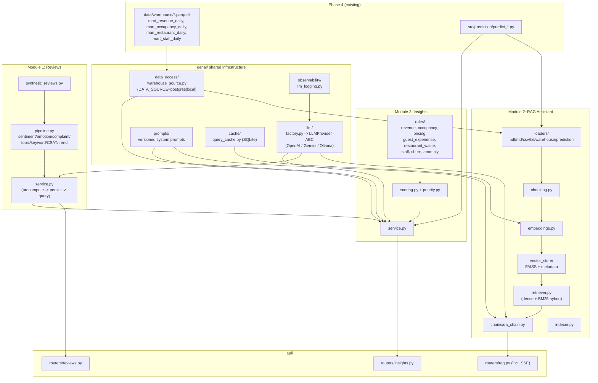
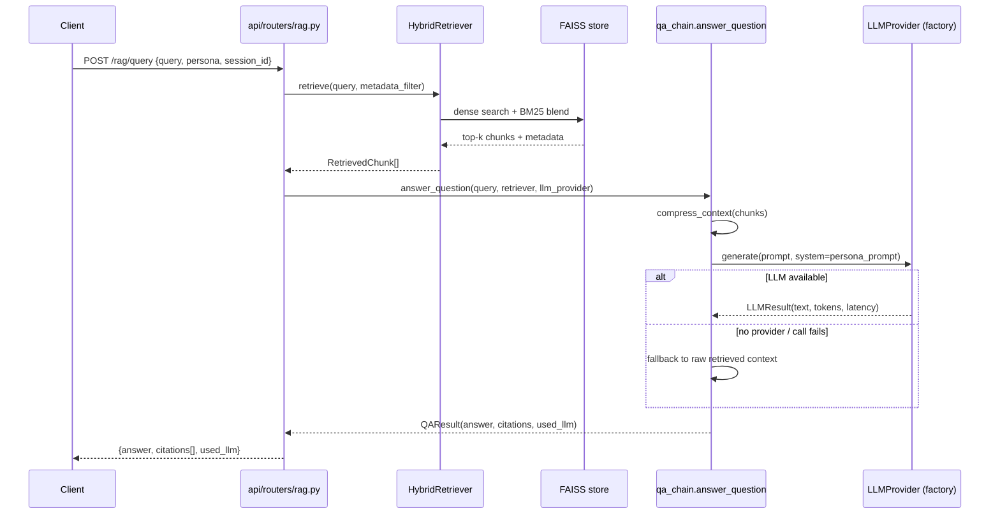
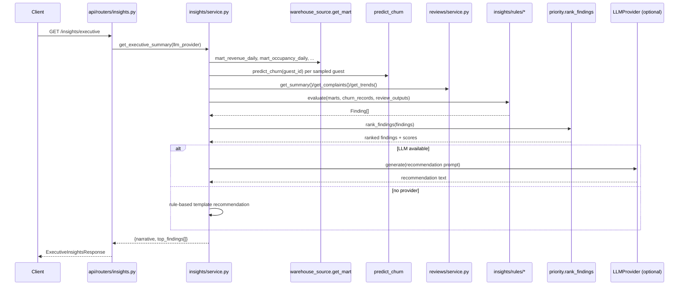
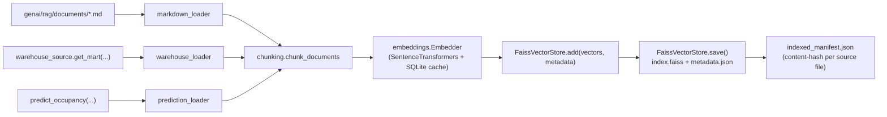
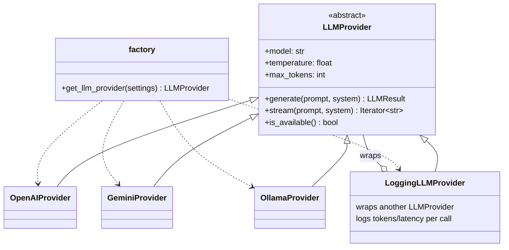

# Phase 5 — Generative AI Layer

Phase 5 adds a Generative AI layer on top of the Phase 4 ML modules,
implemented as a `genai/` subpackage inside this repository (not a separate
service) because it consumes ML predictions and warehouse data directly,
in-process. It ships three modules — Guest Review Analysis, a RAG-based
Hotel AI Assistant, and an AI Insights Generator — plus the shared LLM
provider abstraction, embeddings/vector-store infrastructure, prompt
versioning, observability, and caching that they all sit on top of.

## Architecture overview



## RAG query flow (sequence)



## Insights generation flow (sequence)



## Embedding / indexing flow



## LLM provider abstraction



Switching `LLM_PROVIDER` in `.env` between `ollama`/`openai`/`gemini` is a
config-only change — no code in `genai/reviews`, `genai/rag`, or
`genai/insights` references a concrete provider class; they all depend on
`genai.llm.factory.get_llm_provider()` and the `LLMProvider` ABC.

## Configuration

New environment variables, read by `genai/config/genai_settings.py`
(`pydantic-settings`, same pattern as `src/config/settings.py`):

| Variable | Default | Purpose |
|---|---|---|
| `LLM_PROVIDER` | `ollama` | `ollama` \| `openai` \| `gemini` |
| `LLM_MODEL` | `llama3.1` | Provider-specific model name |
| `TEMPERATURE` | `0.3` | LLM sampling temperature |
| `MAX_TOKENS` | `1024` | Max output tokens |
| `OPENAI_API_KEY` | unset | Required only if `LLM_PROVIDER=openai` |
| `GEMINI_API_KEY` | unset | Required only if `LLM_PROVIDER=gemini` |
| `OLLAMA_BASE_URL` | `http://localhost:11434` | Local Ollama server |
| `EMBEDDING_MODEL` | `sentence-transformers/all-MiniLM-L6-v2` | SentenceTransformers model |
| `VECTOR_DB_DIR` | `genai/rag/vector_store` | FAISS index + metadata location |
| `DOCUMENT_DIR` | `genai/rag/documents` | Source documents for indexing |
| `DATA_SOURCE` | `local` | `postgres` \| `local` |
| `ENABLE_RAG` | `true` | Gates RAG index warm-up at API startup |
| `ENABLE_MEMORY` | `true` | Gates session conversation memory |

None of these are required to boot the API or run the test suite — every
provider and the RAG index gracefully degrade (rule-based fallback text,
empty-index 503, skipped startup warm-up) when unconfigured.

## Module 1 — Guest Review Analysis

No real guest review data exists anywhere in this project. `genai/reviews/synthetic_reviews.py`
generates a large (default 60,000, configurable up to 100,000), seeded,
English-majority dataset with smaller Sinhala/Tamil samples, written to
`data/raw/guest_reviews_synthetic.csv`. `genai/reviews/pipeline.py` runs
lexicon-based sentiment/emotion/complaint detection (deterministic, no
model download required — appropriate given the reviews are themselves
template-generated from known phrase banks), TF-IDF + optional KeyBERT
keyword extraction, sklearn LDA topic modeling (chosen over BERTopic to
avoid a heavy transformer dependency chain), LLM-based summarization with
map-reduce batching (falls back to a deterministic rule-based summary
without an LLM), and CSAT scoring (0-100) at hotel/daily/weekly/monthly
grain with rolling-window trend detection.

`genai/reviews/service.py` implements a precompute-then-query pattern:
`POST /reviews/analyze` runs the full pipeline and persists outputs to
`data/processed/reviews/*.parquet`/`.json`; the `GET /reviews/*` endpoints
only read those persisted outputs, returning `503` if analysis hasn't run
yet.

## Module 2 — Hotel AI Assistant (RAG)

Loaders under `genai/rag/loaders/` cover PDF (pypdf), Markdown (heading-aware
chunking), CSV, and TXT documents, plus two HotelMind-specific loaders:
`warehouse_loader.py` (renders mart rows into natural-language sentences via
`data_access.warehouse_source`) and `prediction_loader.py` (calls
`src/prediction/predict_occupancy.py` directly, in-process). Two real,
detailed starter documents ship under `genai/rag/documents/`:
`hotel_policies.md` and `hotel_sop.md`.

`chunking.py` implements a recursive, separator-aware splitter (paragraph →
sentence → hard window) with configurable size/overlap. `embeddings.py`
wraps SentenceTransformers with a SQLite content-hash cache
(`genai/cache/query_cache.py`) so repeated text is never re-embedded.
`vector_store/faiss_store.py` persists a FAISS `IndexFlatIP` plus a JSON
metadata sidecar (used both for retrieval filtering and answer citations).
`retriever.py` blends dense FAISS similarity with BM25 keyword scoring and
supports metadata filtering (doc type, branch, date range) plus context
compression to a character budget before hitting the LLM. `memory.py`
provides per-session conversation history (TTL + max-turn trimming), gated
by `ENABLE_MEMORY`. `chains/qa_chain.py` wires retrieval → compression →
persona prompt → LLM → answer, attaching structured citations
(`{source, doc_type, score}`) to every response — not just prose — and
gracefully falls back to raw retrieved context when no LLM is
available/configured. `indexer.py` supports both a full rebuild and an
incremental rebuild (content-hash-tracked; unchanged documents are only
re-embedded if the FAISS flat index would otherwise need row deletion,
which it does not support in-place, so any document change triggers a full
rebuild — a documented, deliberate tradeoff for a Phase-5-scale index).

`POST /rag/query` supports both a JSON response and SSE token streaming
(`stream: true`, via `sse-starlette`) for the same endpoint.

## Module 3 — AI Insights Generator

`genai/insights/rules/` implements one module per category — revenue,
occupancy, pricing, guest_experience, restaurant_waste, staff, churn,
anomaly — each evaluating real threshold/trend conditions against mart
data, review-analysis outputs, or churn predictions, and emitting a
structured `Finding` (category, title, metric, delta, severity,
supporting_data, citation). `scoring.py` converts severity + delta
magnitude into a numeric priority score (log-scaled so large-magnitude
deltas like complaint counts don't drown out percentage-point deltas);
`priority.py` ranks and filters findings. `service.py` orchestrates
everything — warehouse marts, in-process ML predictions, and Module 1
review outputs — and generates recommendation text via the LLM factory,
**always** falling back to a deterministic rule-based template
(`[SEVERITY] title (delta). Review <metric> for <citation>...`) when no LLM
provider/key is configured, so the endpoints never hard-fail on a missing
API key.

## API Reference

| Method | Path | Purpose | Success | Errors |
|---|---|---|---|---|
| `POST` | `/reviews/analyze` | Run the review pipeline and persist outputs | `200` | `500` |
| `GET` | `/reviews/summary` | Overall sentiment summary + keywords + CSAT by hotel | `200` | `503` (not analyzed yet) |
| `GET` | `/reviews/topics` | LDA topic clusters | `200` | `503` |
| `GET` | `/reviews/complaints` | Complaint category counts | `200` | `503` |
| `GET` | `/reviews/trends?grain=daily\|weekly\|monthly` | CSAT time series + trend direction | `200` | `503`, `422` (bad grain) |
| `POST` | `/rag/index` | Full FAISS index rebuild | `200` | `500` |
| `POST` | `/rag/reindex` | Incremental FAISS index rebuild | `200` | `500` |
| `GET` | `/rag/stats` | Index status + vector count | `200` | `500` |
| `POST` | `/rag/query` | Ask a question (JSON or `stream: true` for SSE) | `200` | `503` (empty index), `500` |
| `GET` | `/insights` | All findings, filterable by `category`/`min_severity` | `200` | `500` |
| `GET` | `/insights/executive` | Top-N findings + narrative briefing | `200` | `500` |
| `GET` | `/insights/recommendations` | Recommendation text per finding | `200` | `500` |
| `GET` | `/insights/anomalies` | Statistical anomaly findings only | `200` | `500` |

## Deployment notes

- **Ollama (default, no API key)**: install Ollama locally, `ollama pull
  llama3.1`, leave `LLM_PROVIDER=ollama` and `OLLAMA_BASE_URL` at its
  default. `OllamaProvider.is_available()` checks reachability before
  every call and every caller falls back gracefully if it's down.
- **OpenAI / Gemini**: set `LLM_PROVIDER=openai` or `gemini` and the
  corresponding `*_API_KEY` in `.env`. No other code changes required.
- **DATA_SOURCE=postgres**: requires the live `hotelmind_warehouse`
  Postgres instance reachable via `src.config.settings.settings.WAREHOUSE_DB_URL`;
  `DATA_SOURCE=local` (default) works fully standalone, synthesizing small
  mart-equivalent CSV snapshots under `data/warehouse/` on first access if
  they don't already exist.
- **RAG index**: not built automatically at startup unless a prior index
  exists on disk; `ENABLE_RAG=false` skips even the warm-up read. Run
  `python -m genai.rag.indexer --rebuild` or call `POST /rag/index` to
  build it.

## Testing

`tests/genai/` — 300+ tests, offline (fake LLM providers, fake
SentenceTransformers embedder, isolated tmp warehouse/vector-store
directories). Run:

```bash
pytest tests/ --cov=genai --cov=api --cov-report=term-missing
```

Coverage on `genai/` is ≥90% at the time of writing.
