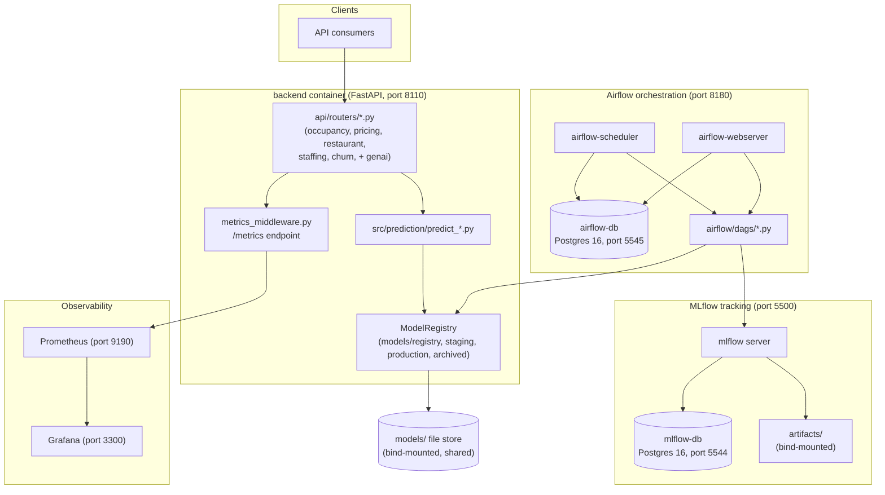
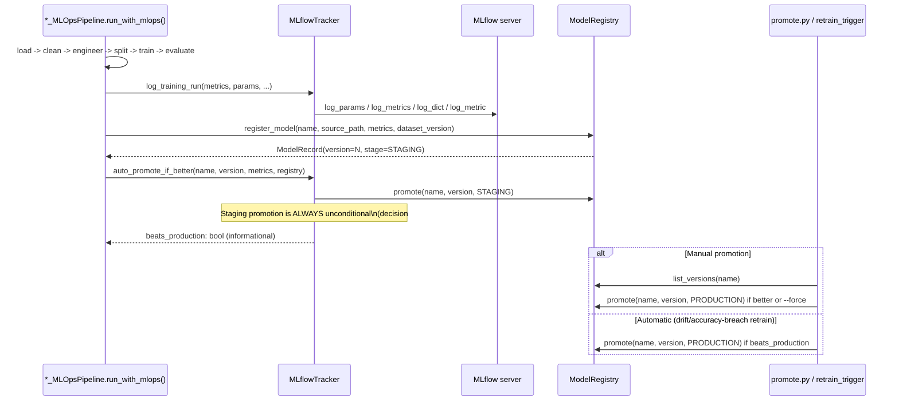

# Phase 6 — MLOps Platform

Phase 6 converts HotelMind AI's flat, hardcoded `models/*.pkl` serving
convention (Phases 1-5) into a production-grade, **local-first, Docker-only
MLOps platform**: experiment tracking (MLflow), a real model registry with
promotion/rollback, dataset versioning, orchestrated retraining (Airflow),
observability (Prometheus/Grafana), and drift detection (Evidently AI) — all
without breaking any existing API, model, folder, or test. No AWS or paid
cloud service is required; the design stays portable to Kubernetes/AWS later.

## Architecture overview



The backend and Airflow containers share the same `models/`, `reports/`,
`dashboards/`, `logs/`, and `mlruns/` directories via bind mounts, so a model
registered/promoted by an Airflow DAG run is immediately visible to the
FastAPI backend's next prediction request — no restart, no shared database
required for the registry itself (it's a flat-file store, deliberately, to
stay simple and inspectable).

## Registry flow



Every successful training run lands in `models/registry/<name>/<version>/model.pkl`
and is auto-promoted to Staging. Production promotion always requires a
separate, explicit, gated decision — either a human running `promote.py`, or
the automatic drift/accuracy-breach retrain trigger (M12) confirming the new
version is actually better. Production never silently regresses.

## Promotion flow

`MLflowTracker.auto_promote_if_better(model_name, new_version, new_metrics,
registry, primary_metric, lower_is_better)`:

1. Always calls `registry.promote(model_name, new_version, ModelStage.STAGING)`
   — every successful training run becomes a Staging candidate.
2. Compares `new_metrics[primary_metric]` against the current Production
   record's same metric, direction-aware (`lower_is_better=True` for MAE/
   RMSE/MAPE, `False` for F1/AUC/accuracy).
3. Returns `True`/`False` — **informational only**. It never promotes to
   Production itself.

Production promotion is decision #2 from the Phase 6 design: Staging
auto-promotes on every run; Production is always gated. Two paths reach
Production:

- **Manual**: `python promote.py --model occupancy [--variant xgboost] [--force]`
  — looks up the latest Staging version, compares it against the current
  Production record on the model's primary metric (via
  `MODEL_METRIC_DIRECTION`), and only promotes if it's actually better (or
  `--force` is passed). Prints a clear no-op message and exits `1` if the
  Staging candidate doesn't beat Production and `--force` wasn't given.
- **Automatic**: `check_and_retrain()` (M12), invoked from the `daily_training`
  Airflow DAG, retrains a domain when drift or accuracy-drop thresholds are
  breached, then calls `auto_promote_if_better()` and only promotes to
  Production if the retrain result is actually better — otherwise the new
  version stays in Staging for a human to inspect.

## Rollback

`python rollback.py --model <domain> [--variant <variant>] [--to-version N]`
re-promotes a previous registry version back to Production, archiving
whatever is currently in Production. `DOMAIN_TO_PRIMARY_MODEL` (defined in
`promote.py` and reused by `rollback.py`) maps a bare domain name to its
primary registered model:

| Domain | Primary model (no `--variant`) | Valid `--variant` values |
|---|---|---|
| `occupancy` | `occupancy_prophet` | `prophet`, `xgboost` |
| `pricing` | `pricing_xgboost` | (none) |
| `staffing` | `staffing_regression` | (none) |
| `churn` | `churn_xgboost` | `xgboost`, `random_forest` |
| `restaurant` | — (variant required) | `breakfast`, `lunch`, `dinner` |

Without `--to-version`, `ModelRegistry.rollback()` finds the highest-numbered
`ARCHIVED` version and re-promotes it. Example transcript, run against the
freshly-seeded registry (see Deployment Guide below) where only one version
exists per model and nothing has been archived yet:

```
$ python rollback.py --model occupancy
Rollback failed for model_name='occupancy_prophet': No archived version available to roll back to for model_name='occupancy_prophet'
```

This is the correct, honest behavior for a registry with a single version —
`rollback.py` exits `1` and explains why rather than silently no-op'ing. Once
a second version has been registered and promoted over the first (archiving
it), `rollback.py --model occupancy` would instead print:

```
Rolled back model_name='occupancy_prophet' to version=1 (stage=production, metrics={...}).
```

## Airflow DAGs

All four DAGs live in `airflow/dags/`, run in the `airflow-scheduler`
container (custom image built from `airflow/Dockerfile`, `FROM
apache/airflow:2.9.3-python3.12` + `requirements-training.txt` installed
against Airflow's own pinned constraints file to avoid dependency conflicts).
DAGs are paused at creation (`AIRFLOW__CORE__DAGS_ARE_PAUSED_AT_CREATION=true`)
so nothing runs automatically until an operator explicitly unpauses them.

### `daily_training` (`@daily`)

Per-domain conditional retraining. Delegates entirely to
`check_and_retrain()` (M12) for each of the 9 model names — checks the
latest Evidently drift score (M9) and the accuracy-drop delta between the
current Production record and the latest registered version (M11 metrics),
and only retrains (`*_MLOpsPipeline.run_with_mlops()`) domains that breach
either `RETRAIN_DRIFT_SCORE_THRESHOLD` or `RETRAIN_ACCURACY_DROP_THRESHOLD`.
One domain's failure is caught and logged, not allowed to fail the whole DAG
run.

### `weekly_full_retrain` (`@weekly`)

Unconditional full retrain of all 5 domains via `run_with_mlops()`,
regardless of drift/accuracy signal — a backstop against silent staleness
even if drift detection itself has a blind spot. Also registers a versioned
JSON snapshot of the sentiment lexicon/config
(`genai/reviews/pipeline.py`'s positive/negative word lists +
`COMPLAINT_CATEGORIES`) as a lightweight pseudo-model (`sentiment_lexicon`)
in the registry, per decision #4 — sentiment has no trainable model, but
still becomes a real registry citizen with a content-hash-derived version.

### `monthly_model_validation` (`@monthly`)

Read-only health check: re-evaluates each domain's *current Production*
model(s) against freshly loaded/cleaned/engineered holdout data (reusing the
pipeline's own `load_data`/`clean`/`engineer_features`/`split`/`evaluate`
steps — never reimplementing evaluation logic) and writes the results to the
M11 evaluation dashboard (`dashboards/model_evaluation_dashboard.json`). Never
retrains or promotes anything.

### `nightly_data_validation` (`0 2 * * *`)

For every domain: computes the current `DatasetVersion` (M4), checks
`has_dataset_changed()` against the last saved snapshot, saves the new
snapshot, and generates an Evidently data-drift report (M9) comparing the
loaded dataframe against itself as both reference and current input (the
dataset-version mechanism only persists metadata, not raw dataframe
snapshots, so the drift report here characterizes the current data's
distribution for the ops dashboard even without a persisted historical
dataframe — a documented, deliberate scope limit, not a bug).

## Monitoring

`src/mlops/monitoring/metrics_middleware.py` wraps the FastAPI app with
`prometheus_fastapi_instrumentator` (automatic per-route request count/latency
metrics) and exposes hand-instrumented prediction metrics. All metrics are
served at **`GET /metrics`** in Prometheus text exposition format, scraped by
the `prometheus` container (`monitoring/prometheus/prometheus.yml`) and
visualized in the `grafana` container (provisioned datasource +
`dashboards/grafana_hotelmind_overview.json`, both auto-loaded via
`monitoring/grafana/provisioning/`).

| Metric | Type | Labels | Meaning |
|---|---|---|---|
| `hotelmind_predictions_total` | Counter | `domain`, `model_version` | Successful predictions served, per domain and serving model version |
| `hotelmind_prediction_latency_seconds` | Histogram | `domain` | Per-request prediction latency |
| `hotelmind_prediction_errors_total` | Counter | `domain` | Failed prediction requests, per domain |
| `hotelmind_model_version` | Gauge | `model_name` | Currently loaded production model version |
| `hotelmind_process_cpu_percent` | Gauge | (none) | Backend process CPU percent (via `psutil`) |
| `hotelmind_process_ram_mb` | Gauge | (none) | Backend process RSS megabytes |
| `http_request_duration_seconds` (and related) | Histogram/Counter | route, method, status | Auto-instrumented per-endpoint request metrics from `prometheus_fastapi_instrumentator` |

Every router (`occupancy`, `pricing`, `restaurant`, `staffing`, `churn`) wraps
its prediction call with a `time.perf_counter()` timer and calls
`record_prediction(domain, model_version, latency_s, error=...)` — additive,
non-invasive to the existing `try/except FileNotFoundError -> 503` control
flow. `record_prediction()` and `update_resource_gauges()` never raise, even
on malformed input, so a monitoring bug can never take down a prediction
request.

## Drift Detection

Two independent, complementary drift mechanisms:

**Data drift (Evidently)** — `src/mlops/monitoring/drift_detector.py`.
`generate_data_drift_report(reference_df, current_df, module_name)` runs
Evidently's `Report(metrics=[DataDriftPreset()])`, writing an HTML report to
`reports/drift/<module>_data_drift_<timestamp>.html` and a JSON summary
(`share_of_drifted_columns`, `dataset_drift`, `number_of_drifted_columns`) to
the sibling `.json` file. `get_latest_drift_score(module_name)` reads the
most recent JSON summary's `drift_score` — pure file I/O, no Evidently import
required, so it runs on every host including this one. Threshold:
`MLOpsSettings.RETRAIN_DRIFT_SCORE_THRESHOLD` (default `0.30`) — breaching it
is one of the two `check_and_retrain()` triggers.

**Prediction drift (pure Python, no Evidently dependency)** —
`src/mlops/monitoring/prediction_drift.py`. Every router call appends the
full response payload plus a timestamp to
`reports/drift/predictions/<domain>.jsonl` via `log_prediction_for_drift()`
(exception-swallowed, never breaks a request).
`generate_prediction_drift_report(domain, window_days=7)` compares a recent
window against the prior window's mean/std for every numeric field, flagging
instability when the mean shift exceeds `max(0.5 * prior_std, 0.2 *
|prior_mean|)`. Returns `None` (with a warning log) if there isn't enough
history to form two full windows yet — this is expected on a fresh
deployment, not an error condition.

Both mechanisms' thresholds live in `MLOpsSettings`
(`src/mlops/config/mlops_settings.py`):
`RETRAIN_ACCURACY_DROP_THRESHOLD=0.10`, `RETRAIN_DRIFT_SCORE_THRESHOLD=0.30`.

## Deployment Guide

From the `hotelmind-ml/` repo root, with Docker Desktop running:

```bash
docker compose up -d
```

This builds and starts 7 containers: `backend` (8110), `mlflow` (5500) +
`mlflow-db` (5544), `airflow-webserver`/`airflow-scheduler` (8180) +
`airflow-db` (5545), `prometheus` (9190), `grafana` (3300). `airflow-init`
runs once (migrates the Airflow metadata DB, creates the `admin`/`admin`
user) and exits; the webserver/scheduler wait for it to complete
successfully.

**First-run steps**:

1. `docker compose up -d` — wait for all services healthy (`docker compose
   ps`).
2. **Seed the registry from the existing flat `models/*.pkl` files**: run
   `python scripts/seed_registry_from_legacy.py` (on the host, or `docker
   compose exec backend python scripts/seed_registry_from_legacy.py` inside
   the container). This registers each of the 9 existing model files
   (`churn_random_forest.pkl`, `churn_xgboost.pkl`, `occupancy_prophet.pkl`,
   `occupancy_xgboost.pkl`, `pricing_xgboost.pkl`, `restaurant_breakfast.pkl`,
   `restaurant_lunch.pkl`, `restaurant_dinner.pkl`,
   `staffing_regression.pkl`) as registry version 1 with
   `dataset_version="unknown-legacy"`, then promotes each straight to
   Production — so the API serves exactly the same models it did in Phase
   1-5, now via the registry instead of the legacy flat-file fallback. The
   script is idempotent: re-running it after real training history exists
   skips any `model_name` that already has registry entries (checked via
   `list_versions()`), rather than creating duplicate versions.
3. Verify: `curl http://localhost:8110/health`, `curl
   http://localhost:8110/metrics`, MLflow UI at `http://localhost:5500`,
   Airflow UI at `http://localhost:8180` (login `admin`/`admin`), Grafana at
   `http://localhost:3300` (login `admin`/`admin`), Prometheus at
   `http://localhost:9190`.
4. In the Airflow UI, unpause the DAGs you want scheduled (all start paused);
   or trigger one manually to test end-to-end.

## Troubleshooting

**Port conflicts with the sibling `hotelmind-data` stack.** `hotelmind-data`
already runs its own Airflow (8080), Postgres (5433/5434), and MinIO (9000/9001).
`hotelmind-ml`'s `docker-compose.yml` deliberately uses distinct host ports so
both stacks can run simultaneously:

| Service | hotelmind-ml host port | Container port |
|---|---|---|
| backend | 8110 | 8000 |
| mlflow | 5500 | 5000 |
| mlflow-db | 5544 | 5432 |
| airflow-webserver | 8180 | 8080 |
| airflow-db | 5545 | 5432 |
| prometheus | 9190 | 9090 |
| grafana | 3300 | 3000 |

If a port is still reported as in use, check for a leftover container from a
previous `docker compose up` (`docker ps -a`) or another local service bound
to that port, rather than assuming a collision with `hotelmind-data`.

**MLflow/Airflow Postgres connection issues.** Both `mlflow-db` and
`airflow-db` have `healthcheck: pg_isready` gates; `mlflow` and
`airflow-init`/`airflow-webserver`/`airflow-scheduler` all `depends_on` their
respective DB with `condition: service_healthy`. If MLflow or Airflow fail to
start, check `docker compose logs mlflow-db` / `docker compose logs
airflow-db` first — a common cause is a stale named volume
(`mlflow_db_data`/`airflow_db_data`) from a prior incompatible schema version;
`docker compose down -v` (destructive — wipes tracked runs/DAG history) and
`docker compose up -d` again resolves it for a fresh local dev environment.

**"model not found" 503s.** Every router wraps its prediction call in `except
FileNotFoundError as exc: raise HTTPException(status_code=503, ...)`.
`ModelRegistry.load_production()` raises exactly `FileNotFoundError` (never a
generic `Exception`) when **both** the registry's flat production path
(`models/production/<name>.pkl`) **and** the legacy flat path
(`settings.model_dir_path/<name>.pkl`) are missing — i.e. the model has never
been trained/registered by any means. A 503 here means: run
`scripts/seed_registry_from_legacy.py` (if this is a fresh clone with only
the flat `.pkl` files) or train the domain (`python scripts/train_all.py
--mlops`) to populate the registry.
