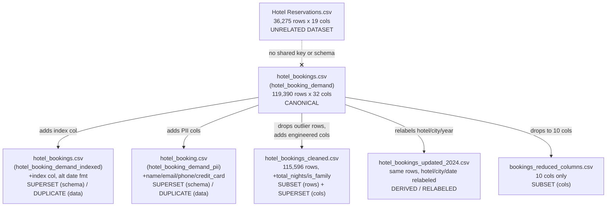

# Dataset Comparison & Relationships

## Family groupings

There are really only **two independent datasets** hiding behind seven files:

**Family A — "Hotel Booking Demand"** (Portugal hotel group, 2015–2017, 119,390 reservations)
- `hotel_booking_demand/original/hotel_bookings.csv` — **canonical form**
- `hotel_booking_demand_indexed/original/hotel_bookings.csv` — same rows + `index` column, different date format
- `hotel_booking_demand_pii/original/hotel_booking.csv` — same rows + 4 fabricated PII columns
- `hotel_bookings_variants/original/hotel_bookings_cleaned.csv` — same rows minus 3,794 (outlier/invalid-ADR rows removed), + `total_nights`/`is_family`
- `hotel_bookings_variants/original/hotel_bookings_updated_2024.csv` — same rows, `hotel`/`city`/`arrival_date_year`/`reservation_status_date` re-labeled to a fake 2024 Indian-city scenario
- `hotel_bookings_variants/original/bookings_reduced_columns.csv` — same rows, only 10 columns kept (cancellation-prediction feature subset)

**Family B — "Hotel Reservations Classification Dataset"** (different hotel/guest population, 2017–2018, 36,275 reservations)
- `hotel_reservations/original/Hotel Reservations.csv` — standalone, no overlap with Family A

## Relationship diagram

## Duplicate / subset / superset classification

| Comparison | Relationship | Evidence |
|---|---|---|
| `hotel_booking_demand` vs `hotel_booking_demand_indexed` | **Same data, superset schema** | identical row count (119,390), identical column stats (mean adr 101.83, same category counts); indexed version adds `index` 0–119,389 |
| `hotel_booking_demand` vs `hotel_booking_demand_pii` | **Same data, superset schema** | identical business-column stats; pii version adds 4 synthetic PII columns cycling over only ~5,000 distinct values |
| `hotel_booking_demand` vs `hotel_bookings_cleaned` | **Row subset + column superset** | 115,596 vs 119,390 rows (3,794 fewer); `adr` range narrows from [-6.38, 5400.0] to [0.0, 211.03] — outlier rows dropped; adds `total_nights`, `is_family`; **duplicates NOT removed** (31,822 still present) |
| `hotel_booking_demand` vs `hotel_bookings_updated_2024` | **Same data, relabeled** | identical row count and per-column stats for every untouched column; `hotel`, `city`, `arrival_date_year`, `reservation_status_date` are synthetically rewritten to a fictional 2024/India scenario |
| `hotel_booking_demand` vs `bookings_reduced_columns` | **Column subset** | exactly 10 of the 32 columns, same row count, same per-column stats for the columns that remain |
| `hotel_booking_demand` (any variant) vs `Hotel Reservations.csv` | **Unrelated** | disjoint schemas, disjoint row counts, no shared natural key (`Booking_ID` format `INN#####` vs no ID column in Family A), different date ranges (2017–2018 vs 2015–2017), different ADR ranges |

## Joinability

- **Within Family A**: all six files share row order/positional alignment
  where row counts match (verified via identical column statistics) — they
  are re-exports of the same underlying table, **not** join-able by a natural
  key because none of the base files carries a stable reservation ID. Only
  `hotel_bookings_cleaned.csv` has had rows removed, so positional alignment
  with the other five breaks for that file.
- **Family A ↔ Family B**: **not joinable**. No shared key, no shared guest
  identifiers, disjoint schemas and date ranges. Must be treated as two
  independent sources.
- **Primary/foreign keys**: none of the seven CSVs has a declared primary
  key. `Hotel Reservations.csv`'s `Booking_ID` is unique per row (36,275
  distinct) and is the only usable natural key across all files.

## Datasets with identical schemas

`hotel_booking_demand`, `hotel_booking_demand_indexed` (minus `index`), and
`hotel_booking_demand_pii` (minus the 4 PII columns) share an **identical
32-column schema** with identical column order and identical dtypes.
