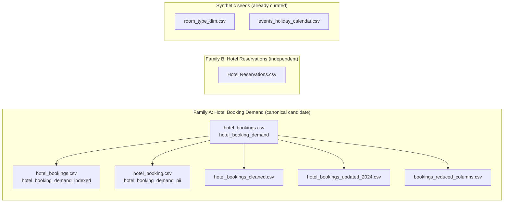
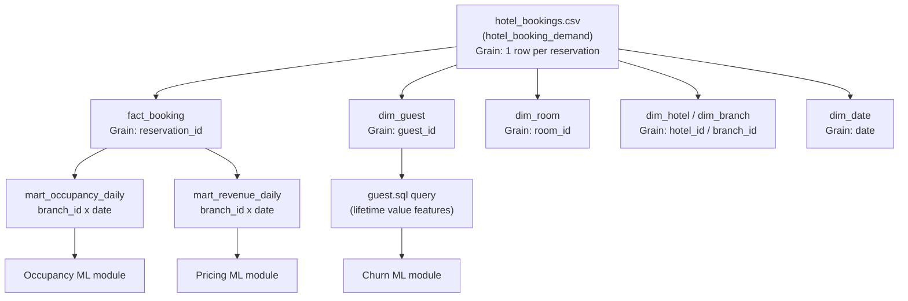
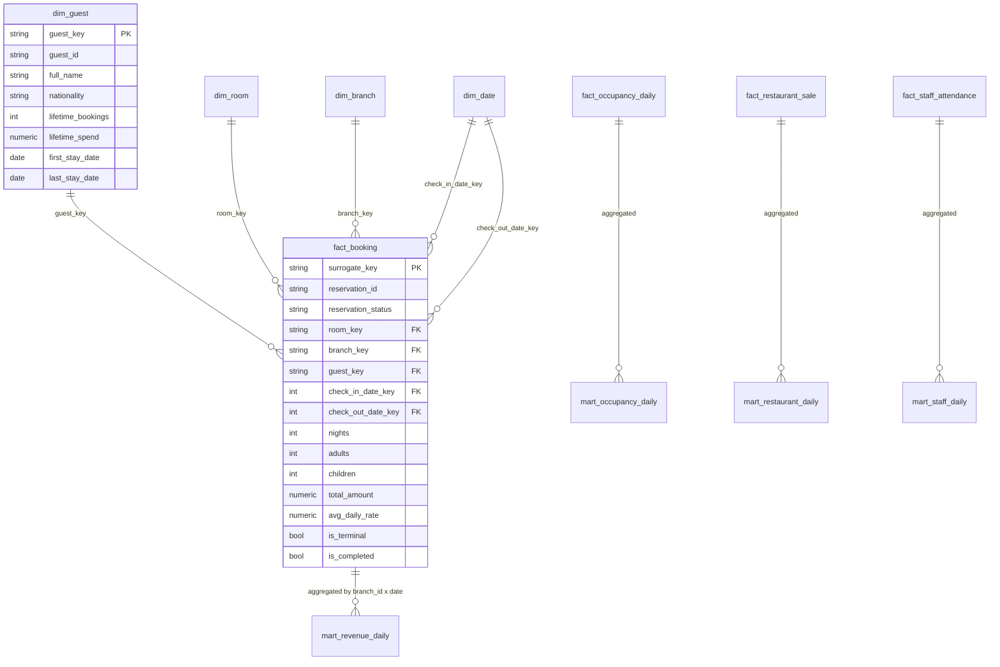

# Schema Diagram — Raw Datasets → Warehouse

## Raw dataset family relationships

## Family A canonical file → Phase 3 warehouse (target grain: `fact_booking`)

## Warehouse star schema (existing, from `hotelmind-data` dbt project)

**Gap:** the Kaggle CSVs have no `hotel_id`/`branch_id`, no `room_id`, no
`guest_id`, and no stable `reservation_id` — see `warehouse_mapping.md` for
how each is synthesized or left unmapped.
