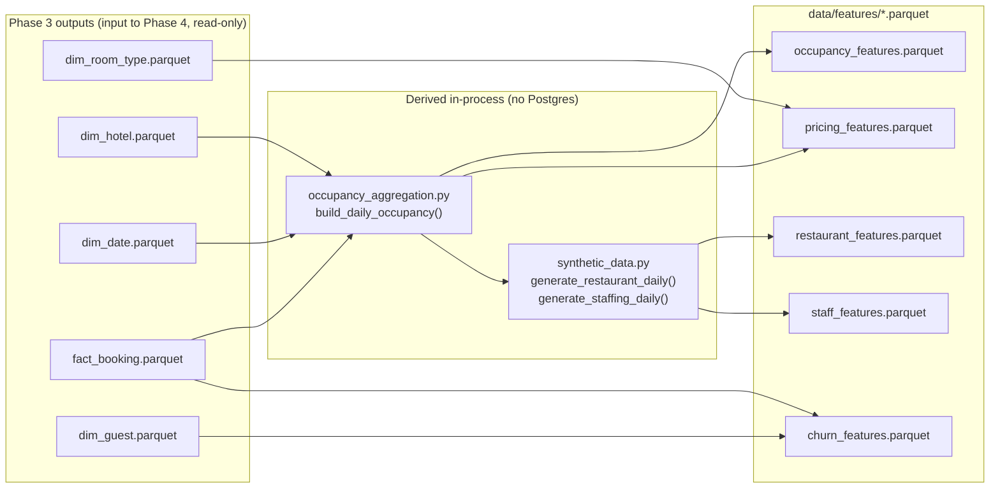
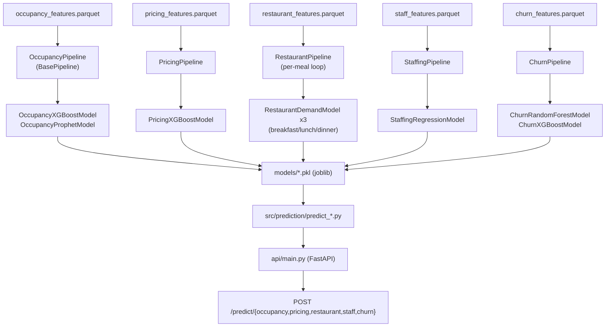
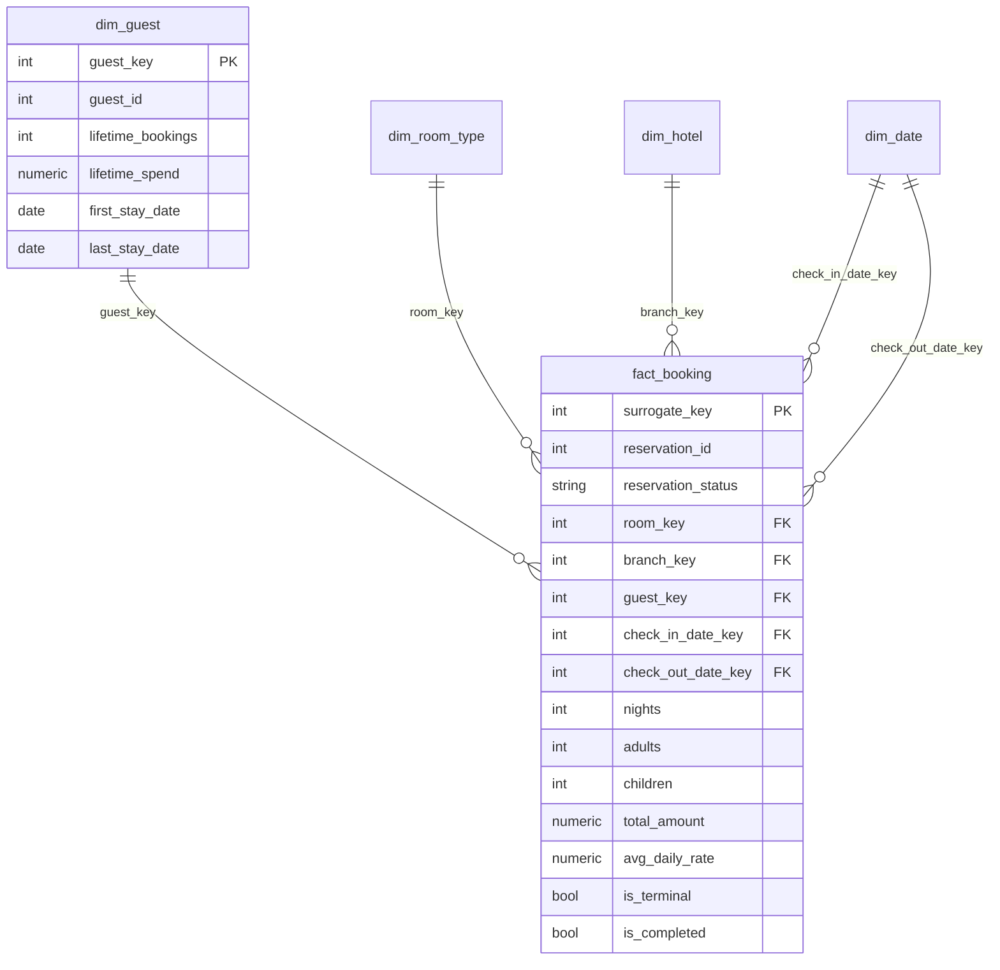

# Pipeline Diagram — Warehouse Parquet → Features → Models → API

## Data lineage: warehouse parquet → derived/synthetic → feature datasets

## Model → prediction → API flow

## Star schema this phase reads from (unchanged from Phase 3)

**Note:** no `fact_occupancy_daily`, `mart_occupancy_daily`,
`mart_revenue_daily`, `mart_restaurant_daily`, or `mart_staff_daily` table
exists anywhere in this project's warehouse parquet set — the Phase-3-era
scaffold assumed these, but they were never populated (see
`reports/final_phase4/known_limitations.md`). `occupancy_aggregation.py`
substitutes for the occupancy/revenue marts; `synthetic_data.py` substitutes
for the restaurant/staff marts.
